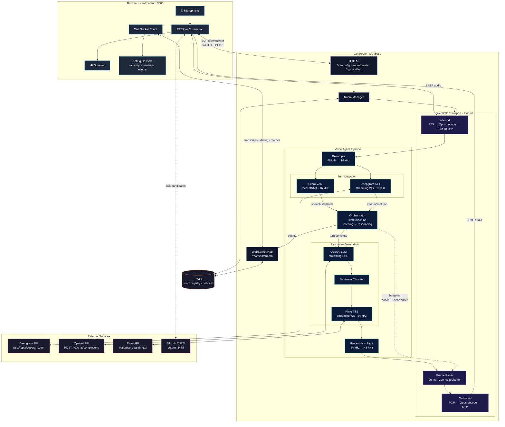

# GoSFU

A forkable WebRTC voice agent server in Go.

Handles the audio transport, turn orchestration, pacing, and barge-in so you can focus on your agent logic.

[](LICENSE) [](https://github.com/gokuljs/goSfu) [](https://youtu.be/-j_NcqJXxuA)

The interesting part is not that it connects a speech model, a language model, and a voice model. That wiring is the easy part. The hard part is what happens between the microphone and the speaker while the clock is running.

Browser audio arrives as Opus over WebRTC. The server decodes it into PCM, resamples it for the parts of the system that need a different clock rate, watches for speech boundaries, waits for a complete user turn, streams a response, turns that response back into audio, reframes it into 20 ms chunks, paces it, and sends it back over WebRTC without stuttering.

If the user interrupts while the agent is speaking, the current response is cancelled and the queued audio is cleared. The system goes back to listening.

That loop is the project.

Most voice agent examples hide the part where time becomes a problem. A text system can wait. A voice system cannot. If audio arrives too early, too late, in the wrong sample rate, in uneven chunks, or after the user has already started talking again, the user hears the bug immediately. This repo keeps those moving parts visible.

It is meant to be forked. Read the orchestrator, swap the providers, change the turn logic, deploy your own version. The debug console shows what the system is doing while the call is running, so you can see the effect of your changes immediately.

I wrote more about the audio side in [When Latency Becomes Audible](https://gokuljs.com/blogs/when-latency-becomes-audible).

**Features:**

- **WebRTC transport** — Opus encode/decode, 48 kHz to model-friendly resampling, 20 ms frame buffering
- **Turn orchestration** — single-owner state machine for listening, responding, and barge-in
- **Audio pacing** — frame pacer that turns bursty generated audio into a steady playout clock with backpressure
- **Streaming pipeline** — chunked response output, streaming resampling, fade-in/out at utterance boundaries
- **Provider interfaces** — pluggable LLM, STT, TTS, and VAD behind clean contracts. Swap vendors without touching the transport layer
- **Live debug console** — browser UI for transcripts, events, latency metrics, connection state, and session quota
- **Redis or in-memory** — Redis-backed room state and event fanout for multi-process deployments, with an in-memory fallback for local dev

## The Core Loop

```text
Browser mic
  -> WebRTC Opus packets
  -> server-side PCM frames
  -> turn detection and transcript collection
  -> response generation
  -> generated PCM audio
  -> resample, reframe, fade, pace
  -> WebRTC Opus packets
  -> browser speaker
```

While the agent is speaking, inbound audio is still monitored. If speech starts again, the server cancels the response path, clears the playout buffer, and returns to listening.

## Architecture



**Connection sequence for one voice turn:**

```mermaid
sequenceDiagram
    participant B as Browser
    participant H as HTTP API
    participant R as Room · PeerConnection
    participant O as Orchestrator
    participant V as Silero VAD
    participant DG as Deepgram
    participant AI as OpenAI
    participant RM as Rime

    B->>H: POST /room/create
    H-->>B: { roomId }
    B->>H: GET /ice-config
    H-->>B: { iceServers }
    B->>B: getUserMedia + createOffer
    B->>H: POST /room/:id/join { sdp, systemPrompt }
    H->>R: SetRemoteDescription → CreateAnswer
    H-->>B: { sdp: answer }

    Note over B,R: ICE + DTLS + SRTP connected

    R->>O: agent.Start()
    O->>RM: greeting text
    RM-->>O: PCM 24 kHz
    O->>R: paced Opus → browser speaker

    rect rgb(15, 23, 42)
        Note over B,DG: User speaks
        B->>R: RTP Opus packets (mic)
        R->>O: PCM 48 kHz → resample 16 kHz
        O->>V: speech frames
        V-->>O: SpeechStart
        O->>DG: PCM 16 kHz stream
        DG-->>O: interim transcripts
        V-->>O: SpeechEnd
        DG-->>O: final transcript
    end

    rect rgb(12, 26, 58)
        Note over O,RM: Agent responds
        O->>AI: StreamCompletion(history)
        AI-->>O: token stream

        loop each sentence
            O->>RM: synthesize(sentence)
            RM-->>O: PCM 24 kHz chunks
            O->>R: resample → reframe → pace → Opus
            R->>B: agent audio
        end
    end

    Note over B,O: If user speaks during response → barge-in → cancel + clear buffer → back to listening
```



## Repository Layout

```text
sfu/
  cmd/sfu/              server entrypoint
  pkg/agent/            conversation orchestrator
  pkg/agent/audio/      frames, resampling, buffering, pacing, Opus helpers
  pkg/agent/transport/  WebRTC transport boundary
  pkg/room/             room lifecycle
  pkg/roomstream/       live transcript/debug/metric streams
  pkg/redisroom/        Redis room registry and pub/sub channel names
  plugins/              provider interfaces and implementations

sfu-frontend/
  src/pages/room.tsx    debug console
  src/hooks/            WebRTC and room stream hooks
  src/components/       metrics, transcript, session, and audio UI
```

## Get API Keys

The demo room requires keys from these three providers:

| Role | Provider | Get a key |
|------|----------|-----------|
| LLM | OpenAI | [platform.openai.com](https://platform.openai.com/api-keys) |
| Speech-to-text | Deepgram | [console.deepgram.com](https://console.deepgram.com/) |
| Text-to-speech | Rime | [rime.ai](https://rime.ai) |

Stub providers exist in the repo for custom wiring, but the demo room uses OpenAI, Deepgram, Rime, and Silero VAD. To swap a vendor, add a provider under `sfu/plugins/`, register it with the matching plugin package, and wire it into the agent config.

## Setup

Pick the path that fits your workflow. Both paths start the same Go server — Docker just handles the system dependencies for you.

### Option A — Docker (no Go or system libs required)

The `docker-compose.yml` starts the SFU, a Redis instance, and a local coturn TURN relay together. You only need [Docker Desktop](https://www.docker.com/products/docker-desktop/).

**1. Copy and fill in the env file**

```bash
cd sfu
cp .env.example .env
```

Open `sfu/.env` and set the three required keys:

```env
OPENAI_API_KEY=...
DEEPGRAM_API_KEY=...
RIME_API_KEY=...
```

You do not need to set `REDIS_URL` for Docker — compose wires the SFU to Redis automatically.

**2. Start the backend stack**

```bash
docker compose up --build
```

This builds the Go binary inside the container (including ONNX Runtime and the Silero model), starts the SFU on port `8080`, Redis on the internal Docker network, and coturn on port `3478`. No extra steps needed.

Verify the server is up:

```bash
curl -s http://localhost:8080/ice-config | python3 -m json.tool
```

You should see `stun:` and `turn:` entries in the response. In the SFU logs, look for `redis=enabled`. To ping Redis inside the stack:

```bash
docker compose exec redis redis-cli ping
```

You should see `PONG`.

**3. Start the frontend (new terminal)**

```bash
cd sfu-frontend
cp .env.example .env
bun install
bun run dev
```

Open `http://localhost:3000`, click connect, and allow microphone access.

---

### Option B — Manual (Go + system libs on the host)

**Requirements:** Go 1.26+, Bun 1.3+.

**1. Install ONNX Runtime**

Voice activity detection (Silero VAD) requires ONNX Runtime on the host.

macOS:

```bash
brew install onnxruntime
```

Linux (x64):

```bash
ORT_VERSION=1.18.1
ORT_ARCH=linux-x64

curl -LO "https://github.com/microsoft/onnxruntime/releases/download/v${ORT_VERSION}/onnxruntime-${ORT_ARCH}-${ORT_VERSION}.tgz"
tar -xzf "onnxruntime-${ORT_ARCH}-${ORT_VERSION}.tgz"

sudo mkdir -p /usr/local/include/onnxruntime /usr/local/lib
sudo cp "onnxruntime-${ORT_ARCH}-${ORT_VERSION}"/include/*.h /usr/local/include/onnxruntime/
sudo cp "onnxruntime-${ORT_ARCH}-${ORT_VERSION}"/lib/libonnxruntime.so* /usr/local/lib/
sudo ldconfig
```

**2. Download the model and install deps**

```bash
cd sfu
./scripts/download-model.sh
go mod tidy
```

**3. Configure and run the backend**

```bash
cp .env.example .env
```

Open `sfu/.env` and set the three required keys:

```env
OPENAI_API_KEY=...
DEEPGRAM_API_KEY=...
RIME_API_KEY=...
```

```bash
go run ./cmd/sfu
```

**4. Start the frontend (new terminal)**

```bash
cd sfu-frontend
cp .env.example .env
bun install
bun run dev
```

Open `http://localhost:3000`, click connect, and allow microphone access.

**TURN relay (optional for local, required for production)**

STUN works for simple same-machine setups. For production behind strict NATs or firewalls, add a TURN relay. Run coturn alongside the SFU:

```bash
docker run -d --name coturn \
  -p 3478:3478/udp -p 3478:3478/tcp \
  -p 49160-49200:49160-49200/udp \
  coturn/coturn:latest \
  -n --log-file=stdout --lt-cred-mech --fingerprint \
  --user=gosfu:change-me --realm=localhost \
  --external-ip=127.0.0.1 --relay-ip=127.0.0.1 \
  --min-port=49160 --max-port=49200 \
  --allow-loopback-peers
```

Then add matching credentials to `sfu/.env` and restart the server:

```env
TURN_URLS=turn:localhost:3478?transport=udp,turn:localhost:3478?transport=tcp
TURN_USERNAME=gosfu
TURN_CREDENTIAL=change-me
```

---

## Production TURN

For a real deployment, run coturn on a host with a stable public IP. Open UDP/TCP `3478` and the relay range (e.g. `49160–49200`).

```bash
docker run -d --name coturn --restart unless-stopped \
  -p 3478:3478/udp -p 3478:3478/tcp \
  -p 49160-49200:49160-49200/udp \
  coturn/coturn:latest \
  -n --log-file=stdout --lt-cred-mech --fingerprint \
  --user=gosfu:strong-password --realm=turn.example.com \
  --external-ip=YOUR_PUBLIC_IP \
  --min-port=49160 --max-port=49200
```

Set matching values in `sfu/.env`:

```env
TURN_URLS=turn:turn.example.com:3478?transport=udp,turn:turn.example.com:3478?transport=tcp
TURN_USERNAME=gosfu
TURN_CREDENTIAL=strong-password
```

To confirm TURN is wired up, run `curl -s http://localhost:8080/ice-config | python3 -m json.tool` after restarting the SFU. Then open `chrome://webrtc-internals`, join a room, and check that `typ relay` candidates appear.

## Contributing

The direction of this project should come from what people actually try to build with it.

If you want a feature or hit a limitation, open an issue with the use case. Provider implementations, transport options, deployment guides, and orchestration changes are all welcome; start with an issue so the approach is clear.

Small fixes and documentation improvements can go straight to a PR.

See [CONTRIBUTING.md](CONTRIBUTING.md) for setup, checks, and PR guidelines.
